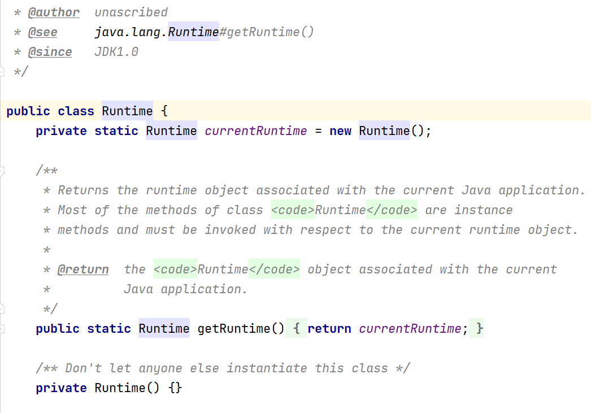

# 单例设计模式

## 1. 单例设计模式介绍
所谓类的单例设计模式，就是**采取一定的方法保证在整个的软件系统中，对某个类只能存在一个对象实例**，并且该类只提供一个取得其对象实例的方法（静态方法）。

比如Hibernate的SessionFactory,它充当数据存储源的代理，并负责创建Session对象。SessionFactory并不是轻量级的，一般情况下，一个项目通常只需要一个SessionFactory就够了，这时就会使用到单例模式。

## 2. 单例设计模式八种方式
1. **饿汉式（静态常量）**
2. **饿汉式（静态代码块）**
3. 懒汉式（线程不安全）
4. 懒汉式（线程安全，同步方法）
5. 懒汉式（线程安全，同步代码块）
6. **双重检查**
7. **静态内部类**
8. **枚举**

## 3. 饿汉式
### 3.1 （静态常量）代码实现
```java
/**
 * @ProjectName: 设计模式
 * @ClassName: Singleton 饿汉式（静态常量）
 * @Auther: wczy
 * @Date: 2020-11-26 19:33
 * @Version 1.0
 **/
public class Singleton1 {
    //1、构造器私有化
    private Singleton1(){}
    //2、类的内部创建对象
    private static final Singleton1 instance = new Singleton1();
    //3、向外暴露一哥静态的公共方法，getInstance()
    public Singleton1 getInstance(){
        return instance;
    }
}
```
### 3.2 （静态代码块）代码实现
```java
/**
 * @ProjectName: 设计模式
 * @ClassName: Singleton2 饿汉式（静态代码块）
 * @Auther: wczy
 * @Date: 2020-11-26 19:55
 * @Version 1.0
 **/
public class Singleton2 {
    //1、构造器私有化
    private Singleton2(){}
    //2、类的内部创建对象
    private static final Singleton2 instance;
    //3、在静态代码块中创建单例对象
    static {
        instance = new Singleton2();
    }
    //4、向外暴露一哥静态的公共方法，getInstance()
    public Singleton2 getInstance(){
        return instance;
    }
}
```
### 3.3 优缺点说明
1. 优点：简单，在类加载时就完成了实例化。避免了线程同步的问题。
2. 缺点：在类加载的时候就完成实例化，没有达到Lazy Loading的效果。如果从始至终从未使用过这个实例，则会造成内存的浪费。
3. 这种方式基于classloder机制避免了多线程的同步问题，不过，instance在类加载时就实例化，在单例模式中大多数都是调用getInstance方法，但是导致类加载的原因有很多种，因此不能确定有其他的方式（或者其他的静态方法）导致类加载，这时候初始化instance就没有达到Lazy Loading的效果。
4. 这种单例模式可用，可能会造成内存浪费。

## 4. 懒汉式（线程不安全）
### 4.1 代码实现
```java
/**
 * @ProjectName: 设计模式
 * @ClassName: Singleton3  饿汉式（线程不安全）
 * @Auther: wczy
 * @Date: 2020-11-26 20:00
 * @Version 1.0
 **/
public class Singleton3 {
    //1、构造器私有化
    private Singleton3(){}
    //2、创建单例对象
    private static Singleton3 instance;
    //3、提供一个静态方法，当用到该方法时采取创建instance
    public static Singleton3 getInstance(){
        if (instance == null){
            instance = new Singleton3();
        }
        return instance;
    }
}
```
### 4.2 优缺点说明
1. 优点：这种方式起到了Lazy Loading的效果，但是只能在单线程下使用。
2. 缺点：如果在多线程下，一个线程进入了if (instance == null)判断语句，还未往下执行，另一个线程也通过了这个判断语句，这时便会产生多个实例。所以在多线程环境下不可使用这种方式。
3. 结论：在实际开发中，不要使用这种方式。

## 5. 懒汉式（线程安全）
### 5.1 （同步方法）代码实现
```java
/**
 * @ProjectName: 设计模式
 * @ClassName: Singleton4  饿汉式（线程安全，同步方法）
 * @Auther: wczy
 * @Date: 2020-11-26 20:15
 * @Version 1.0
 **/
public class Singleton4 {
    //1、构造私有化
    private Singleton4(){}
    //2、创建单例对象
    private static Singleton4 instance;
    //3、提供一个静态方法，加入同步处理代码，解决线程安全问题
    public static synchronized Singleton4 getInstance(){
        if (instance == null){
            instance = new Singleton4();
        }
        return instance;
    }
}
```
### 5.2 （同步代码块）代码实现
```java
/**
 * @ProjectName: 设计模式
 * @ClassName: Singleton5  饿汉式（线程安全，同步代码块）
 * @Auther: wczy
 * @Date: 2020-11-26 20:21
 * @Version 1.0
 **/
public class Singleton5 {
    //1、构造私有化
    private Singleton5(){}
    //2、创建单例对象
    private static Singleton5 instance;
    //3、提供一个静态方法，加入同步处理代码，解决线程安全问题
    public static Singleton5 getInstance(){
        if (instance == null){
            synchronized (Singleton5.class){
                instance = new Singleton5();
            }
        }
        return instance;
    }
}
```
### 5.3 优缺点说明
1. 优点：解决了线程安全问题。
2. 缺点：效率低，每个线程在想获得类的实例的时候，执行getInstance()方法都要进行同步，而这个方法只执行一次实例化代码就够了，后面想获得该类实例，直接return就行了。
3. 总结：在实际开发中。不推荐使用这种方式。
## 6 双重检查
### 6.1 代码实现
```java
/**
 * @ProjectName: 设计模式
 * @ClassName: Singleton6 双重检查 Lazy Loading
 * @Auther: wczy
 * @Date: 2020-11-26 21:19
 * @Version 1.0
 **/
public class Singleton6 {
    //1、构造私有化
    private Singleton6(){}
    //2、创建单例对象
    private static volatile Singleton6 instance;
    //3、提供一个静态方法，加入同步处理代码，解决线程安全问题,同时解决Lazy Loading问题
    public static Singleton6 getInstance(){
        if (instance == null){
            synchronized (Singleton6.class){
                if (instance == null)
                    instance = new Singleton6();
            }
        }
        return instance;
    }
}
```
### 6.2 优缺点说明
1. Double-Check概念是多线程开发中常使用到的，如代码中所示，进行两次if (instance == null)检查，这样就可以保证线程安全了。
2. 同时实例化代码只用执行一次，后面再次访问，判断if (instance == null)，直接return实例化对象，也避免了反复进行方法同步。
3. 总结：线程安全，延迟加载，效率极高，在实际开发中，推荐使用这种单例设计模式。

## 7. 静态内部类
### 7.1 代码实现
```java
/**
 * @ProjectName: 设计模式
 * @ClassName: Singleton7  静态内部类
 * @Auther: wczy
 * @Date: 2020-11-26 21:29
 * @Version 1.0
 **/
public class Singleton7 {
    //1、构造器私有化
    private Singleton7(){}
    //2、创建单例对象
    private static volatile Singleton7 instance;
    //3、一个静态内部类，该类中有一个静态属性Singleton7
    private static class SingletonInstance{
        private static final Singleton7 INSTANCE = new Singleton7();
    }
    //4、提供一个静态方法，直接返回SingletonInstance.INSTANCE
    public static Singleton7 getInstance(){
        return SingletonInstance.INSTANCE;
    }
}
```
### 7.2 优缺点说明
1. 这种方式采用类加载的机制来保护初始化实例时只有一个线程。
2. 静态内部类方式在Singleton7类被加载时并不会立即被实例化，而是在需要实例化时，调用getInstance方法，才会加载SingletonInstance类，从而完成Singleton7的实例化。
3. 类的静态属性只会在第一次加载类的时候初始化，所以在这里，JVM帮助我们保证了线程的安全性，在类进行初始化时，别的线程是无法进入的。
4. 总结：线程安全，利用静态内部类的特点实现延迟加载，效率高，在实际开发中，推荐使用这种方式。
## 8. 枚举
### 8.1 代码实现
```java
/**
 * @ProjectName: 设计模式
 * @ClassName: Singleton8  枚举
 * @Auther: wczy
 * @Date: 2020-11-26 21:44
 * @Version 1.0
 **/
public class Singleton8 {
    //1、构造私有化
    private Singleton8(){}
    //2、使用枚举类型
    private enum Singleton{
        //3、定义INSTANCE常量
        INSTANCE;
        //4、创建单例对象
        private final Singleton8 instance;
        //5、在枚举类构造器中实例化单例对象
        Singleton(){
            instance = new Singleton8();
        }
        //6、定义getInstance方法返回instance
        private Singleton8 getInstance(){
            return instance;
        }
    }
    //8、提供对外开发的静态方法返回实例对象
    public static Singleton8 getInstance(){
        return Singleton.INSTANCE.getInstance();
    }
}
```
### 8.2 优缺点说明
1. 借组枚举来实现单例模式，不仅能避免多线程同步问题，还能防反射、防止反序列化重新创建对象。
2. 枚举单例的懒加载是值得商榷的一点，如果枚举中定义了静态变量/常量/方法的话，那么当使用的时候可能会破坏单例的懒加载。
3. 这是方式是Effective Java作者Josh Bloch提倡的，推荐使用。
## 9. 破解单例模式
以Double-Check方式实现的单例模式为例
### 9.1 反射破解代码实现
```java
public class Singleton6 {
    //1、构造私有化
    private Singleton6(){}
    //2、创建单例对象
    private static volatile Singleton6 instance;
    //3、提供一个静态方法，加入同步处理代码，解决线程安全问题,同时解决Lazy Loading问题
    public static Singleton6 getInstance(){
        if (instance == null){
            synchronized (Singleton6.class){
                if (instance == null)
                    instance = new Singleton6();
            }
        }
        return instance;
    }

    public static void main(String[] args) throws Exception{
        //通过getInstance方法获取的单例对象
        Singleton6 instance = Singleton6.getInstance();
        //通过反射获取的单例对象
        Singleton6 newInstance = Singleton6.class.getDeclaredConstructor().newInstance();
        //确定两个对象是否为同一个(结果为false)
        System.out.println(instance == newInstance);
    }
}
```
### 9.2 反序列化破解
```java
public class Singleton6 implements Serializable {
    //1、构造私有化
    private Singleton6(){}
    //2、创建单例对象
    private static volatile Singleton6 instance;
    //3、提供一个静态方法，加入同步处理代码，解决线程安全问题,同时解决Lazy Loading问题
    public static Singleton6 getInstance(){
        if (instance == null){
            synchronized (Singleton6.class){
                if (instance == null)
                    instance = new Singleton6();
            }
        }
        return instance;
    }

    public static void main(String[] args) throws Exception{
        //通过getInstance方法获取的单例对象
        Singleton6 instance = Singleton6.getInstance();
        //通过序列化创建对象
        ObjectOutputStream oos = new ObjectOutputStream(new FileOutputStream("newSingleton"));
        oos.writeObject(instance);
        oos.flush();
        oos.close();
        ObjectInputStream ois = new ObjectInputStream(new FileInputStream("newSingleton"));
        Singleton6 newSingleton = (Singleton6)ois.readObject();
        ois.close();
        //确定两个对象是否为同一个(结果为false)
        System.out.println(instance == newSingleton);
    }
}
```
### 9.3 枚举类实现的单例
枚举类型是所有单例模式实现中唯一一种不会被破坏的单例实现模式。原因如下
1. **枚举类型在Java中是无法通过反射来创建的，否则会抛异常**；
2. **在序列化的时候Java仅仅是将枚举对象的name属性输出到结果中，反序列化的时候是通过java.lang.Enum的valueOf方法来根据名字查找枚举对象，所以反序列化创建的对象是同一个对象。同时，编译器是不允许任何对这种序列化机制的定制的，因此禁用了writeObject、readObject、readObjectNoData、writeReplace和readResolve等方法**。

## 10. 单例模式在JDK应用的源码分析
1. 在JDK中，java.lang.Runtime就是经典的d单例模式（饿汉式）；



## 11. 单例模式注意事项和细节说明
1. 单例模式保证了系统内存中该类中只存在一个对象，节省了系统资源，对于一些需要频繁创建销毁的对象，使用单例模式可以提高系统性能；
2. 当想实例化一个单例类的时候，必须要记住使用相应的获取对象的方法，而不是使用new；
3. 单例模式使用场景：需要频繁的进行创建和销毁的对象、创建对象时耗时过多或耗费资源过多（即：重量级对象），但又经常用到的对象、工具类对象、频繁访问数据库或文件的对象（比如数据源、session工厂等）。