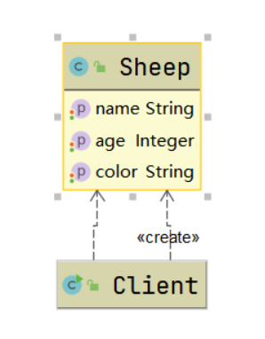
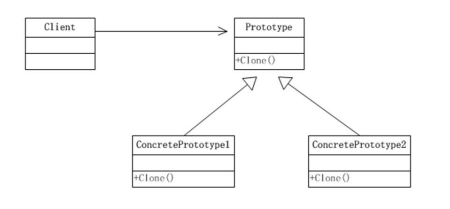
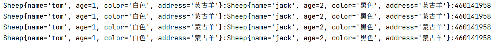
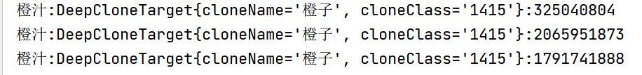

# 原型模式
## 1. 克隆羊问题
现在有一只羊tom，姓名为tom，年龄为1，颜色为白色，请编写程序创建和tom羊熟悉完全相同的十只羊。

## 2. 传统方式实现
### 2.1 思路分析



### 2.2 代码实现
```java
/**
 * @ProjectName: 设计模式
 * @ClassName: Client
 * @Auther: wczy
 * @Date: 2020-12-01 21:34
 * @Version 1.0
 **/
public class Client {
    public static void main(String[] args) {
        Sheep sheep = new Sheep("tom", 1, "白色");

        Sheep sheep1 = new Sheep(sheep.getName(), sheep.getAge(), sheep.getColor());
        //.....
    }
}
```
### 2.3 优缺点
1. 优点：好理解，易操作。
2. 缺点：如果创建的对象比较复杂时，效率低；总是需要重新初始化对象，而不是动态地获取对象运行时的状态，不够灵活。
3. 改进思路：**Java中Object类是所有类的根类，Object类提供了一个clone方法，该方法可以将一个Java对象复制一份，但是需要实现clone的Java类必须要实现Cloneable接口，该接口表示该类能够复制且具有复制的能力。**

## 3. 原型模式
### 3.1 基本介绍
1. 原型模式：用原型实例指定创建对象的种类，并且通过拷贝这些原型，创建新的对象。
2. 是一种创建型设计模式，允许一个对象再创建另外一个可定制的对象，无需知道如何创建的细节。
3. 工作原理：通过将一个原型对象传给那个要发动创建的对象，这个要发动创建的对象需要通过请求原型对象拷贝它们自己来实施创建，即对象.clone()。
4. 可以理解为孙悟空一根毛可以变出另一个孙悟空。

### 3.2 原理结构图

说明：
1. Prototype：原型类，声明一个克隆自己的接口。
2. ConcretePrototype：具体的原型类，实现一个克隆自己的操作。
3. Client：让一个原型对象克隆自己，从而创建一个新的对象（属性一样）。

### 3.3 实现克隆羊问题
```java
/**
 * @ProjectName: 设计模式
 * @ClassName: Sheep
 * @Auther: wczy
 * @Date: 2020-12-01 21:33
 * @Version 1.0
 **/
public class Sheep implements Cloneable {
    private String name;
    private Integer age;
    private String color;
    private String address = "蒙古羊";
    //对象，克隆是会如何处理，默认是浅拷贝
    public Sheep friend;

    public Sheep() {
    }

    public Sheep(String name, Integer age, String color) {
        this.name = name;
        this.age = age;
        this.color = color;
    }

    public String getName() {
        return name;
    }

    public void setName(String name) {
        this.name = name;
    }

    public Integer getAge() {
        return age;
    }

    public void setAge(Integer age) {
        this.age = age;
    }

    public String getColor() {
        return color;
    }

    public void setColor(String color) {
        this.color = color;
    }

    @Override
    public String toString() {
        return "Sheep{" +
                "name='" + name + '\'' +
                ", age=" + age +
                ", color='" + color + '\'' +
                ", address='" + address + '\'' +
                '}';
    }

    @Override
    protected Object clone() throws CloneNotSupportedException {
        Sheep sheep = (Sheep)super.clone();
        return sheep;
    }
}
```
```java
/**
 * @ProjectName: 设计模式
 * @ClassName: Client
 * @Auther: wczy
 * @Date: 2020-12-01 21:34
 * @Version 1.0
 **/
public class Client {
    public static void main(String[] args) {
        Sheep sheep = new Sheep("tom", 1, "白色");
        sheep.friend= new Sheep("jack", 2, "黑色");

        try {
            Sheep sheep1 = (Sheep)sheep.clone();
            Sheep sheep2 = (Sheep)sheep.clone();
            Sheep sheep3 = (Sheep)sheep.clone();
            System.out.println(sheep+":"+sheep.friend+":"+sheep.friend.hashCode());
            System.out.println(sheep1+":"+sheep1.friend+":"+sheep1.friend.hashCode());
            System.out.println(sheep2+":"+sheep2.friend+":"+sheep2.friend.hashCode());
            System.out.println(sheep3+":"+sheep3.friend+":"+sheep3.friend.hashCode());
        } catch (CloneNotSupportedException e) {
            e.printStackTrace();
        }
    }
}
```
输出结果：


## 4. 浅拷贝和深拷贝
### 4.1 浅拷贝的介绍
1. 对于数据类型是基本数据类型的成员变量，浅拷贝会直接进行值传递，也就是将该属性值复制一份给新的对象。
2. 对于数据类型是引用数据类型的成员变量，比如数组，某个类的对象等，那么浅拷贝会进行引用传递，也就是只是将该成员变量的引用值（内存地址）复制一份给新的对象。所以实际上两个对象的该成员变量都指向同一个实例。在这种情况下，在一个对象中修改该成员变量会影响到另一个对象的该成员变量值。
3. clone()方法是默认使用浅拷贝的。

### 4.2 深拷贝基本介绍
1. 复制对象的所有基本数据类型的成员变量值。
2. 为所有引用数据类型的成员变量申请存储空间，并复制每个引用数据类型数据变量所引用的对象，直到该对象可达的所有对象。**也就是说，对象进行深拷贝要对整个对象（包括对象的引用类型）进行拷贝**。
3. 实现深拷贝的方式：重写clone方法；通过对象序列化。

### 4.3 深拷贝代码实现
```java
/**
 * @ProjectName: 设计模式
 * @ClassName: DeepCloneTarget
 * @Auther: wczy
 * @Date: 2020-12-01 22:50
 * @Version 1.0
 **/
public class DeepCloneTarget implements Cloneable, Serializable {
    private String cloneName;
    private String cloneClass;

    public DeepCloneTarget(String cloneName, String cloneClass) {
        this.cloneName = cloneName;
        this.cloneClass = cloneClass;
    }

    @Override
    public String toString() {
        return "DeepCloneTarget{" +
                "cloneName='" + cloneName + '\'' +
                ", cloneClass='" + cloneClass + '\'' +
                '}';
    }

    //因为该类的属性都是String，所以使用默认的clone完成深拷贝
    @Override
    protected Object clone() throws CloneNotSupportedException {
        return super.clone();
    }
}
```
```java
/**
 * @ProjectName: 设计模式
 * @ClassName: DeepProtoType  实现深拷贝
 * @Auther: wczy
 * @Date: 2020-12-01 22:54
 * @Version 1.0
 **/
public class DeepProtoType implements Serializable,Cloneable {
    public String name;
    //引用类型
    public DeepCloneTarget deepCloneTarget;

    public DeepProtoType(){
        super();
    }

    //方式一：重写clone方法，无法实现真正意义上的深度克隆
    @Override
    protected Object clone() throws CloneNotSupportedException {
        Object deep = null;
        //先完成基本数据类型和String的克隆
        deep = super.clone();
        //对引用类型的属性，进行单独处理
        DeepProtoType deepProtoType = (DeepProtoType)deep;
        deepProtoType.deepCloneTarget = (DeepCloneTarget)deepCloneTarget.clone();
        return deepProtoType;
    }

    //方式二：通过对象的序列化实现（推荐），可以实现真正的深度克隆。
    public Object deepClone(){
        ByteArrayOutputStream bos = null;
        ObjectOutputStream oos = null;
        ByteArrayInputStream bis = null;
        ObjectInputStream ois = null;
        try {
            //序列化
            bos = new ByteArrayOutputStream();
            oos = new ObjectOutputStream(bos);
            //将当前这个对象以对象流的方式输出
            oos.writeObject(this);
            //反序列化
            bis = new ByteArrayInputStream(bos.toByteArray());
            ois = new ObjectInputStream(bis);
            DeepProtoType deepProtoType = (DeepProtoType)ois.readObject();
            return deepProtoType;
        }catch (Exception e){
            e.printStackTrace();
            return null;
        }finally {
            try {
                bos.close();
                oos.close();
                bis.close();
                ois.close();
            }catch (Exception e2){
                e2.printStackTrace();
            }
        }
    }
}
```
```java
/**
 * @ProjectName: 设计模式
 * @ClassName: Client
 * @Auther: wczy
 * @Date: 2020-12-01 23:07
 * @Version 1.0
 **/
public class Client {
    public static void main(String[] args) throws CloneNotSupportedException {
        DeepProtoType protoType = new DeepProtoType();
        protoType.name = ("橙汁");
        protoType.deepCloneTarget = new DeepCloneTarget("橙子","1415");
        //方式一完成深拷贝
        DeepProtoType protoType1 = (DeepProtoType)protoType.clone();
        //方式二完成深拷贝
        DeepProtoType protoType2 = (DeepProtoType)protoType.deepClone();
        System.out.println(protoType.name+":"+protoType.deepCloneTarget+":"+protoType.deepCloneTarget.hashCode());
        System.out.println(protoType1.name+":"+protoType1.deepCloneTarget+":"+protoType1.deepCloneTarget.hashCode());
        System.out.println(protoType2.name+":"+protoType2.deepCloneTarget+":"+protoType2.deepCloneTarget.hashCode());
    }
}
```
输出结果：



## 5. 原型模式的注意事项和细节
1. 创建新的对象比较复杂时，可以利用原型模式简化对象的创建过程，同时也能提高效率。
2. 不用重新初始化对象，而是**动态地获取对象运行时**的状态。
3. 如果原始对象发生变化（增加或减少属性），其他克隆对象也会发生相应的变化，无需修改代码。
4. 如果能保证在拷贝对象后，只是对拷贝对象成员变量为基本类型和String类型进行操作，可以使用浅拷贝，像对复杂对象操作，一般使用深拷贝，或者对非基本类型单独实现拷贝进行修改。业务中灵活掌握。
5. 缺点：需要为每一个类配备一个克隆方法，这对全新的类来说不是很难，但对已有的类进行改造时，需要修改器源代码，**违背了ocp原则**。