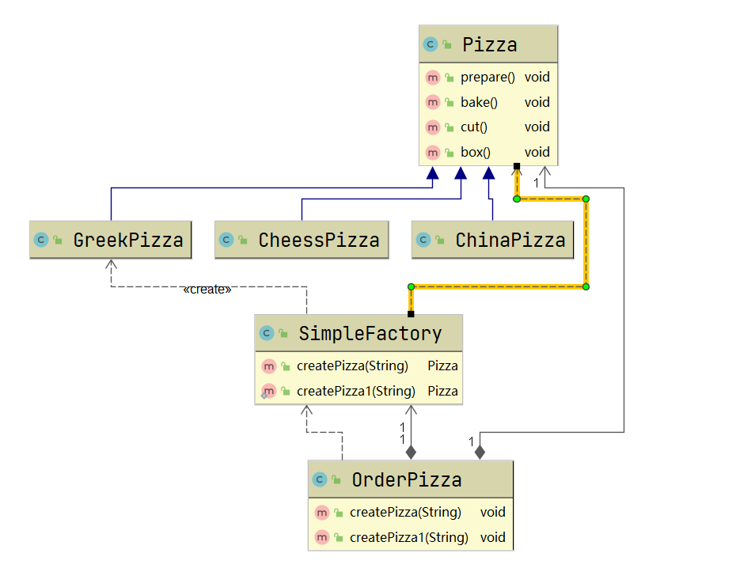
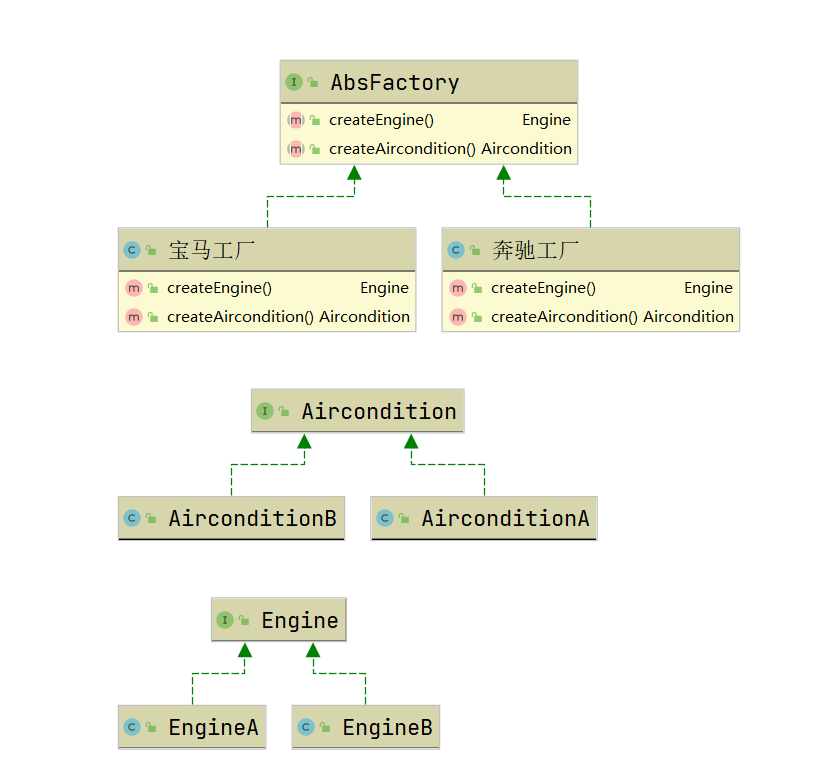

# 工厂模式
* [1.具体需求](#21-代码实现)
## 1. 具体需求
### 1.1 具体需求
一个披萨的项目：要便于披萨种类的扩展，要便于维护。
1. 披萨的种类很多，如GreekPizza、CheesePizza等；
2. 披萨的制作有prepare、bake、cut、box；
3. 完成披萨店订购功能。

## 2. 传统方式实现
思路分析：    

### 2.1 代码实现
```java
/**
 * @ProjectName: 设计模式
 * @ClassName: OederPizza  传统方式下单
 * @Auther: wczy
 * @Date: 2020-11-28 16:07
 * @Version 1.0
 **/
public class OrderPizza {
    Pizza pizza = null;
    public OrderPizza(String orderType){
        if (orderType!=null && !"".equals(orderType.trim())){
            if (orderType.equals("greek"))
                pizza = new GreekPizza();
            else if (orderType.equals("cheese"))
                pizza = new GreekPizza();
            else if (orderType.equals("china"))
                pizza = new GreekPizza();
            else System.out.println("没有"+orderType+"品种的披萨");
        }
        if (pizza!=null){
            pizza.prepare();
            pizza.bake();
            pizza.cut();
            pizza.box();
        }
    }
}
```
### 2.2 传统方式优缺点
1. 优点：好理解，易操作；
2. 缺点：违反了设计模式的ocp原则，即对修改关闭，对扩展开方。当我们需要新增一个Pizza的终类时，在创建Pizza对象需增加一个if判断语句。
3. 改进思路：把创建Pizza对象封装到一个类中，这样在我们有新的Pizza种类时，只需要修改该类就行了，其他有创建Pizza对象的代码就不需要更改。（简单工厂模式）

## 3. 简单工厂模式实现
### 3.1 基本介绍
1. 简单工厂模式属于创建型模式，是工厂模式的一种。简单工厂模式是由一个工厂对象决定创建出哪一种产品类的实例，是工厂模式家族中最简单实用的模式。
2. 简单工厂模式：定义一个创建对象的类，由这个类来封装实例化对象的行为（代码）。
3. 在实际开发中，当会用到大量的创建某种、某类或者某批对象时，就会使用到工厂模式。

### 3.2 思路分析

### 3.3 代码实现
```java
/**
 * @ProjectName: 设计模式
 * @ClassName: SimpleFactory  简单工厂类
 * @Auther: wczy
 * @Date: 2020-11-30 12:47
 * @Version 1.0
 **/
public class SimpleFactory {
    public Pizza createPizza(String orderType){
        Pizza pizza = null;
        if (orderType!=null && !"".equals(orderType.trim())){
            if (orderType.equals("greek"))
                pizza = new GreekPizza();
            else if (orderType.equals("cheese"))
                pizza = new GreekPizza();
            else if (orderType.equals("china"))
                pizza = new GreekPizza();
            else {
                System.out.println("没有"+orderType+"品种的披萨");
                return null;
            }
        }
        return pizza;
    }

    //简单工厂模式，也叫静态工厂模式
    public static Pizza createPizza1(String orderType){
        Pizza pizza = null;
        if (orderType!=null && !"".equals(orderType.trim())){
            if (orderType.equals("greek"))
                pizza = new GreekPizza();
            else if (orderType.equals("cheese"))
                pizza = new GreekPizza();
            else if (orderType.equals("china"))
                pizza = new GreekPizza();
            else {
                System.out.println("没有"+orderType+"品种的披萨");
                return null;
            }
        }
        return pizza;
    }
}
```
```java
/**
 * @ProjectName: 设计模式
 * @ClassName: OrderPizza
 * @Auther: wczy
 * @Date: 2020-11-30 12:53
 * @Version 1.0
 **/
public class OrderPizza {
    //定义一个简单工厂对象
    SimpleFactory simpleFactory ;
    Pizza pizza;
    //构造器
    public OrderPizza(SimpleFactory simpleFactory){
        this.simpleFactory = simpleFactory;
    }
    //下单
    public void createPizza(String ordertype){
        do {
            pizza = simpleFactory.createPizza(ordertype);
            if (pizza!=null){
                pizza.prepare();
                pizza.bake();
                pizza.cut();
                pizza.box();
                break;
            }else {
                System.out.println("订购失败");
                break;
            }
        }while (true);
    }

    public void createPizza1(String ordertype){
        do {
            pizza = SimpleFactory.createPizza1(ordertype);
            if (pizza!=null){
                pizza.prepare();
                pizza.bake();
                pizza.cut();
                pizza.box();
                break;
            }else {
                System.out.println("订购失败");
                break;
            }
        }while (true);
    }
}
```

## 4. 工厂方法模式
### 4.1 一个新需求
客户在点披萨时，可以点不同口味的披萨，比如北京的奶酪披萨，北京的胡椒披萨或者伦敦的奶酪披萨，伦敦的胡椒披萨。
### 4.2 解决思路
1. 使用简单工厂模式，创建不同的简单工厂类，比如BJPizzaSimpleFactory、LDPizzaSimpleFactory等，这也是可以的，但是考虑到项目的规模，以及软件的可维护性、可扩展性并不是特别好。
2. 使用工厂方法模式。
### 4.3 工厂方法模式介绍
1. 工厂方法模式设计方案：讲披萨项目的实例化功能抽象成抽象方法，在不同的口味点餐子类中具体实现。
2. 工厂方法模式：定义一个创建对象的抽象方法，由子类决定要实例化的类。工厂方法模式将对象的实例化推迟到子类。
### 4.4 工厂方法模式思路分析

### 4.5 工厂方法模式代码实现
```java
/**
 * @ProjectName: 设计模式
 * @ClassName: OrderPizza
 * @Auther: wczy
 * @Date: 2020-11-30 13:41
 * @Version 1.0
 **/
public interface OrderPizza {
    //定义一个抽象方法，让各个工厂子类自己实现
    Pizza createPizza(String orderType);
}

/**
 * @ProjectName: 设计模式
 * @ClassName: BJOrderPizza
 * @Auther: wczy
 * @Date: 2020-11-30 15:34
 * @Version 1.0
 **/
public class BJOrderPizza implements OrderPizza{
    @Override
    public Pizza createPizza(String orderType) {
        if (orderType != null && !"".equals(orderType.trim())) {
            if (orderType.equals("cheese"))
                return new BJCheesePizza();
            else if (orderType.equals("pepper"))
                return new BJPepperPizza();
            else {
                System.out.println("没有" + orderType + "品种的披萨");
                return null;
            }
        }
        return null;
    }
}

/**
 * @ProjectName: 设计模式
 * @ClassName: BJOrderPizza
 * @Auther: wczy
 * @Date: 2020-11-30 15:34
 * @Version 1.0
 **/
public class LDOrderPizza implements OrderPizza{
    @Override
    public Pizza createPizza(String orderType) {
        if (orderType!=null && !"".equals(orderType.trim())){
            if (orderType.equals("cheese"))
                return new LDCheesePizza();
            else if (orderType.equals("pepper"))
                return new LDPepperPizza();
            else {
                System.out.println("没有"+orderType+"品种的披萨");
                return null;
            }
        }
        return null;
    }
}
```

## 5. 抽象工厂模式
### 5.1 基本介绍
1. 抽象工厂模式是工厂方法模式的升级版本，它用来创建一组相关或相互依赖的对象。
2. 抽象工厂模式提供一个创建一系列相关或者相互依赖对象的接口，而无需指定它们具体的类。也就是一个工厂里放一些相关的类，使工厂数减少。
3. 最大的好处便是易于交换产品系列，其次是让具体的创建实例过程与客户端分离，客户端通过他们的抽象接口操纵实例，产品的具体类名也被具体工厂的实现分离。

### 5.2 思路分析

### 5.3 代码实现
```java
//抽象产品类1 发动机以及型号    
public interface Engine {    
  
}    
//抽象产品类2 空调以及型号    
public interface Aircondition {    
  
}
```
```java
//具体产品类
public class EngineA extends Engine{    
    public EngineA(){    
        System.out.println("制造-->EngineA");    
    }    
}    
public class EngineB extends Engine{    
    public EngineB(){    
        System.out.println("制造-->EngineB");    
    }    
}  
    
public class AirconditionA extends Aircondition{    
    public AirconditionA(){    
        System.out.println("制造-->AirconditionA");    
    }    
}    
public class AirconditionB extends Aircondition{    
    public AirconditionB(){    
        System.out.println("制造-->AirconditionB");    
    }    
}
```
```java
//抽象工厂    
public interface AbstractFactory {    
    //制造发动机  
    public Engine createEngine();  
    //制造空调   
    public Aircondition createAircondition();   
}    
```
```java
//具体工厂类  
public class 奔驰工厂 implements AbstractFactory{      
    @Override    
    public Engine createEngine() {      
        return new EngineA();    
    }    
    @Override    
    public Aircondition createAircondition() {    
        return new AirconditionA();    
    }    
}    
//为宝马车生产配件
public class 宝马工厂 implements AbstractFactory {
     @Override    
    public Engine createEngine() {      
        return new EngineB();    
    }    
    @Override    
    public Aircondition createAircondition() {    
        return new AirconditionB();    
    }    
}
```
### 5.3 分析
抽象工厂模式是工厂方法模式的升级版本，他用来创建一组相关或者相互依赖的对象。他与工厂方法模式的区别就在于，工厂方法模式针对的是一个产品等级结构；而抽象工厂模式则是针对的多个产品等级结构。在编程中，通常一个产品结构，表现为一个接口或者抽象类，也就是说，工厂方法模式提供的所有产品都是衍生自同一个接口或抽象类，而抽象工厂模式所提供的产品则是衍生自不同的接口或抽象类。

## 6. 工厂模式在JDK中应用的源码分析
JDK中的Calendar类中，使用了简单工厂模式
```java
//getInstance方法获取Calendar对象
public static Calendar getInstance(TimeZone zone,Locale aLocale){
        return createCalendar(zone, aLocale);
    }
//调用了createCalendar方法
private static Calendar createCalendar(TimeZone zone,Locale aLocale){
        CalendarProvider provider =LocaleProviderAdapter.getAdapter(CalendarProvider.class, aLocale)
                                 .getCalendarProvider();
        if (provider != null) {
            try {
                return provider.getInstance(zone, aLocale);
            } catch (IllegalArgumentException iae) {
                // fall back to the default instantiation
            }
        }

        Calendar cal = null;

        if (aLocale.hasExtensions()) {
            String caltype = aLocale.getUnicodeLocaleType("ca");
            if (caltype != null) {
                switch (caltype) {
                case "buddhist":
                cal = new BuddhistCalendar(zone, aLocale);
                    break;
                case "japanese":
                    cal = new JapaneseImperialCalendar(zone, aLocale);
                    break;
                case "gregory":
                    cal = new GregorianCalendar(zone, aLocale);
                    break;
                }
            }
        }
        if (cal == null) {
            // If no known calendar type is explicitly specified,
            // perform the traditional way to create a Calendar:
            // create a BuddhistCalendar for th_TH locale,
            // a JapaneseImperialCalendar for ja_JP_JP locale, or
            // a GregorianCalendar for any other locales.
            // NOTE: The language, country and variant strings are interned.
            if (aLocale.getLanguage() == "th" && aLocale.getCountry() == "TH") {
                cal = new BuddhistCalendar(zone, aLocale);
            } else if (aLocale.getVariant() == "JP" && aLocale.getLanguage() == "ja"
                       && aLocale.getCountry() == "JP") {
                cal = new JapaneseImperialCalendar(zone, aLocale);
            } else {
                cal = new GregorianCalendar(zone, aLocale);
            }
        }
        return cal;
    }
```
## 7. 总结
工厂模式主要是为创建对象提供过渡接口，以便将创建对象的具体过程屏蔽隔离起来，达到提高灵活性的目的。 工厂模式可以分为三类： 
1. 简单工厂模式（Simple Factory） 
2. 工厂方法模式（Factory Method） 
3. 抽象工厂模式（Abstract Factory） 
这三种模式从上到下逐步抽象，并且更具一般性。GOF在《设计模式》一书中将工厂模式分为两类：工厂方法模式（Factory Method）与抽象工厂模式（Abstract Factory）。
将简单工厂模式（Simple Factory）看为工厂方法模式的一种特例，两者归为一类。 

工厂方法模式：
一个抽象产品类，可以派生出多个具体产品类。   
一个抽象工厂类，可以派生出多个具体工厂类。   
每个具体工厂类只能创建一个具体产品类的实例。

抽象工厂模式：
多个抽象产品类，每个抽象产品类可以派生出多个具体产品类。   
一个抽象工厂类，可以派生出多个具体工厂类。   
每个具体工厂类可以创建多个具体产品类的实例。   

区别：
工厂方法模式只有一个抽象产品类，而抽象工厂模式有多个。   
工厂方法模式的具体工厂类只能创建一个具体产品类的实例，而抽象工厂模式可以创建多个。 