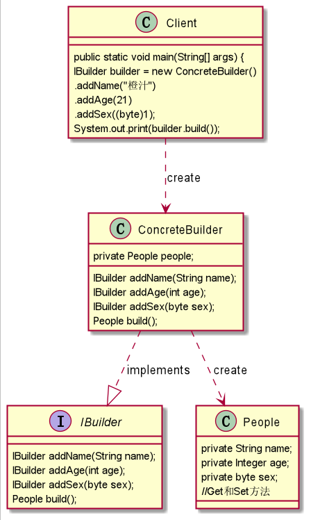
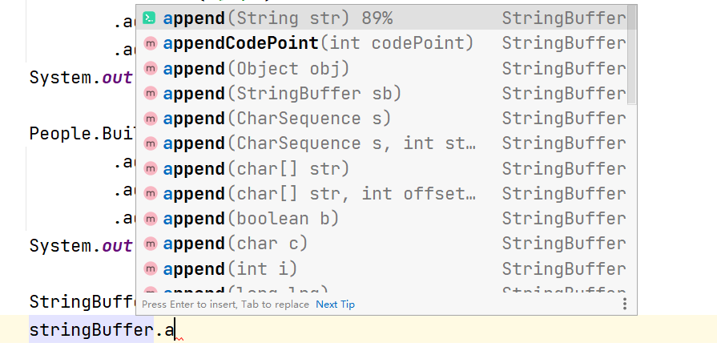
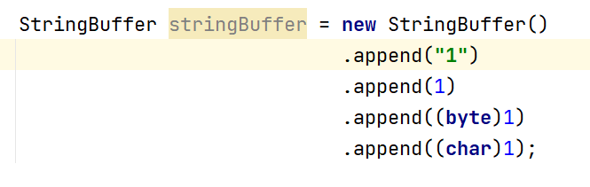

# 建造者模式
## 1. 建造者模式概述
### 1.1 定义
建造者模式将一个复杂对象的构建过程与它的表示分离，使得同样的构建过程可以创建不同的表示，属于创建型设计模式。

根据构建者模式的定义，可以简单地理解为两次含义：
1. 构建与表示分离：构建代表对象创建，表示代表对象行为、方法。也就是将对象的创建与行为进行分离（对应到Java代码，其实就是使用接口规定行为，然后由具体的实现类进行构建）。
2. 创建不同的表示：也就是具备同样的行为，但是却由于构建的行为顺序不同或其他原因可以创建出不同的表示。

### 1.2 分析
建造者模式在日常生活中是很常见的。比如买车时会有低配、高配和顶配，也存在增配和减配的情况，在这个选择的过程中，就是在运用建造者模式。

其实从定义上来看，建造者模式和工厂模式非常相似，和工厂模式一样，具备创建与表示分离的特性，唯一的区别在于建造者模式是针对于复杂对象的创建。

当需要创建的产品具备复杂创建过程时，可以抽取出共性创建过程，然后交由具体实现类自定义创建流程，使得同样的创建行为可以生产出不同的产品，分离了创建与表示，使创建产品的灵活性大大增加。

### 1.3 应用场景
1. 相同的方法，不同的执行顺序会产生不同的结果。
2. 多个部件或零件，都可以装配到一个对象中，但是产生的结果又不相同。
3. 产品类非常复杂，或者产品类中不同的调用顺序产生不同的作用。
4. 初始化一个对象特别复杂，参数多，而且很多参数都具有默认值。

## 2. 实现建造者模式
### 2.1 UML类图


1. 产品(Product)：即People类，要创建的产品类对象。
2. 抽象建造者(IBuilder)：建造者的抽象类，规范产品对象的各个组成部分的创建，一般由子类实现具体的创建过程。
3. 建造者(Concrete Builder)：具体的Builder类，根据不同的业务逻辑，具体化对象的各个组成部分的创建。
4. 调用者(Director)：调用具体的建造者，来创建对象的各个部分，不涉及具体产品的信息，值负责保证对象各部分完整创建或者按某种顺序创建。
### 2.2 建造者模式链式写法
```java
/**
 * @ProjectName: 设计模式
 * @ClassName: People
 * @Auther: wczy
 * @Date: 2020-12-06 18:33
 * @Version 1.0
 **/
public class People {
    private String name;
    private Integer age;
    private byte sex;

    public byte getSex() {
        return sex;
    }

    public void setSex(byte sex) {
        this.sex = sex;
    }

    public Integer getAge() {
        return age;
    }

    public void setAge(Integer age) {
        this.age = age;
    }

    public String getName() {
        return name;
    }

    public void setName(String name) {
        this.name = name;
    }

    @Override
    public String toString() {
        return "People{" +
                "name='" + name + '\'' +
                ", age=" + age +
                ", sex='" + (sex==0?"女":"男") + '\'' +
                '}';
    }
}
```
```java
public interface IBuilder {
    IBuilder addName(String name);
    IBuilder addAge(int age);
    IBuilder addSex(byte sex);
    People build();
}

/**
 * @ProjectName: 设计模式
 * @ClassName: ConcreteBuilder
 * @Auther:
 * @Date: 2020-12-06 18:34
 * @Version 1.0
 **/
public class ConcreteBuilder implements IBuilder {
    private People product = new People();

    @Override
    public IBuilder addName(String name) {
        product.setName(name);
        return this;
    }

    @Override
    public IBuilder addAge(int age) {
        product.setAge(age);
        return this;
    }

    @Override
    public IBuilder addSex(byte sex) {
        product.setSex(sex);
        return this;
    }

    @Override
    public People build() {
        return product;
    }
}
```
```java
/**
 * @ProjectName: 设计模式
 * @ClassName: Client
 * @Auther: wczy
 * @Date: 2020-12-06 18:35
 * @Version 1.0
 **/
public class Client {
    public static void main(String[] args) {
        IBuilder builder = new ConcreteBuilder()
                .addName("橙汁")
                .addAge(21)
                .addSex((byte)1);
        System.out.println(builder.build());

        IBuilder builder1 = new ConcreteBuilder()
                .addName("橙子")
                .addAge(20)
                .addSex((byte)0);
        System.out.println(builder1.build());
    }
}
```
这种写法应该都很熟悉，在使用框架时经常用到这种写法，比如在Mybatis中，通过SqlSessionFactoryBuilder对象调用build()方法获得一个SqlSessionFactory。

### 2.3 静态内部类实现构建者模式
一般情况下，更习惯使用静态内部类的方式实现建造者模式，即一个产品类内部自动带有一个具体建造者，由它来负责该产品的组装创建，不再需要Builder和Director。
```java
/**
 * @ProjectName: 设计模式
 * @ClassName: People
 * @Auther: wczy
 * @Date: 2020-12-06 18:33
 * @Version 1.0
 **/
public class People {
    private String name;
    private Integer age;
    private byte sex;

    public byte getSex() {
        return sex;
    }

    public void setSex(byte sex) {
        this.sex = sex;
    }

    public Integer getAge() {
        return age;
    }

    public void setAge(Integer age) {
        this.age = age;
    }

    public String getName() {
        return name;
    }

    public void setName(String name) {
        this.name = name;
    }

    @Override
    public String toString() {
        return "People{" +
                "name='" + name + '\'' +
                ", age=" + age +
                ", sex='" + (sex==0?"女":"男") + '\'' +
                '}';
    }
    
    public static class Builder{
        private People product = new People();
        
        public Builder addName(String name) {
            product.setName(name);
            return this;
        }
        
        public Builder addAge(int age) {
            product.setAge(age);
            return this;
        }
        
        public Builder addSex(byte sex) {
            product.setSex(sex);
            return this;
        }
        
        public People build() {
            return product;
        }
    
    }
}
```
```java
public class Client {
    public static void main(String[] args) {
         People.Builder builder2 = new People.Builder()
                        .addAge(21)
                        .addName("周杰")
                        .addSex((byte)1);
         System.out.println(builder2.build());
    }
}
```

## 3. JDK源码中建造者模式
JDK中的StringBuffer中，提供了append()方法，开放了构造步骤，内部调用了AbstractStringBuilder的append()方法，而AbstractStringBuilder实现了Appendable接口。
### 3.1 角色分析
1. StringBuilder是一个指挥者同时是一个具体建造者。
2. AbstractStringBuilder是Appendable的一个是实现类，为具体建造者。
3. Appendable接口定义了append()方法，是抽象建造者。
### 3.2 源码分析
Appendable接口定义了三个append()方法，由AbstractStringBuilder来实现
```java
package java.lang;

import java.io.IOException;

public interface Appendable {

    Appendable append(CharSequence csq) throws IOException;
  
    Appendable append(CharSequence csq, int start, int end) throws IOException;
    
    Appendable append(char c) throws IOException;
}
```
AbstractStringBuilder抽象类实现了Appendable接口，他是具体的建造者，在这里完成了一个具体的操作
```java
abstract class AbstractStringBuilder implements Appendable, CharSequence {

    //省略了很多已实现的append()方法
    public AbstractStringBuilder append(String str) {
        if (str == null)
            return appendNull();
        int len = str.length();
        ensureCapacityInternal(count + len);
        str.getChars(0, len, value, count);
        count += len;
        return this;
    }
    
    public AbstractStringBuilder append(StringBuffer sb) {
        if (sb == null)
            return appendNull();
        int len = sb.length();
        ensureCapacityInternal(count + len);
        sb.getChars(0, len, value, count);
        count += len;
        return this;
    }
}
```
创建StringBuilder对象时传入字符串或者调用append()方法传入不同类型的参数时，构造函数传入的字符串和append()方法的参数就相当于指定产品类型，需要构建什么样的产品对象。
```java
 public final class StringBuffer 
    extends AbstractStringBuilder
    implements java.io.Serializable, CharSequence{

    public StringBuffer(String str) {
            super(str.length() + 16);
            append(str);
        }

    //只截取了部分append()方法
    @Override
        public synchronized StringBuffer append(CharSequence s) {
            toStringCache = null;
            super.append(s);
            return this;
        }
    @Override
        public synchronized StringBuffer append(boolean b) {
            toStringCache = null;
            super.append(b);
            return this;
        }
    
        @Override
        public synchronized StringBuffer append(char c) {
            toStringCache = null;
            super.append(c);
            return this;
        }
    
        @Override
        public synchronized StringBuffer append(int i) {
            toStringCache = null;
            super.append(i);
            return this;
        }
}
```


