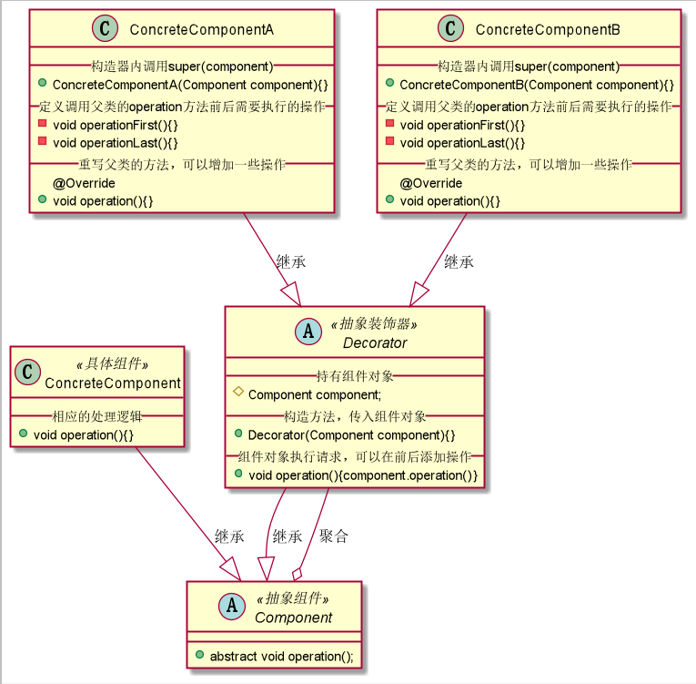
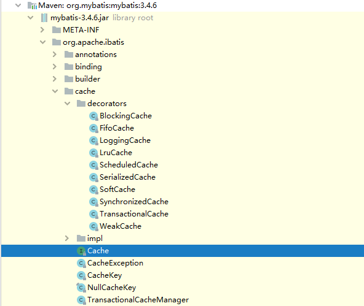

# 装饰器模式
## 1. 装饰器模式概述
### 1.1 定义
装饰器模式也叫作包装器模式，指在不改变原有对象的基础上，动态地给一个对象添加一些额外的职责。就增加功能来说，装饰器模式相比生成子类更加灵活，属于结构型设计模式。

装饰者模式提供了比继承更有弹性的替代方案（扩展原有对象的功能）将功能附加到对象上。因此，装饰者模式的核心就是功能扩展，使用装饰者模式可以透明且动态地扩展类地功能。
### 1.1 应用场景
首先来看一个场景，我们平时九点上班，怎么说都得八点半才起床，所以时间非常紧张，为了更方便的解决早餐问题，我有时候就吃个蛋卷，蛋卷中可以加火腿肠，也可以加香肠，但是
不管怎么“加码”，都还是一个蛋卷。再比如，照片装各种相框，给房子装修，这些都是装饰器模式。

装饰器模式在Java程序中适用于以下应用场景：
1. 用于扩展一个类的功能，或者给一个类添加附加职责；
2. 动态地给一个类添加功能，这些功能可以再动态地被撤销；
3. 需要为一批平行的兄弟类进行改装或加装功能。

## 2. 装饰器模式实现
### 2.1 UML类图


由上图可以看到，装饰器模式主要是含4个角色：
1. 抽象组件(Component)：可以是一个接口或抽象类，充当被装饰类的原始对象，规定了被装饰对象的行为。
2. 具体组件(ConcreteComponent)：实现/继承Component的一个具体对象，即被装饰对象。
3. 抽象装饰器(Decorator)：通用的装饰ConcreteComponent的装饰器，器内部必然有一个熟悉指向Component；其实现一般是一个抽象类，主要为了让其子类按照其构造形式传入
一个Component，这是强制的通用行为。注意：如果系统中装饰逻辑单一，则并不需要实现许多装饰器，可以直接省略该类，而直接实现一个具体装饰器即可。
4. 具体装饰器(ConcreteDecorator)：Decorator的具体实现类，理论上，每个ConcreteDecorator都扩展了一个Component对象的功能。

### 2.2 实现原理
装饰器模式的实现原理是，让装饰器实现与被装饰类相同的接口，使得装饰器与被扩展类型一致，并在构造函数中传入该接口对象，然后在实现这个接口的被包装类对象的现有功能上添加新
功能。由于装饰器与被包装类属于同一类型，且构造函数的参数为其实现接口类，因此装饰器模式具备嵌套扩展功能，这样就能使用装饰器模式一层一层地对底层被包装类进行功能扩展了。

### 2.3 通用实现
```java
/**
 * @ProjectName: 设计模式
 * @ClassName: Component
 * @Auther: wczy
 * @Date: 2020-12-07 23:26
 * @Version 1.0
 **/
public abstract class Component {
    //示例方法
    public abstract void operation();
}

/**
 * @ProjectName: 设计模式
 * @ClassName: ConcreteComponent
 * @Auther: wczy
 * @Date: 2020-12-07 23:27
 * @Version 1.0
 **/
public class ConcreteComponent extends Component{
    @Override
    public void operation() {
        //相应的功能处理
        System.out.println("Orange Code！");
    }
}
```
```java
/**
 * @ProjectName: 设计模式
 * @ClassName: Decorator
 * @Auther: wczy
 * @Date: 2020-12-07 23:29
 * @Version 1.0
 **/
public abstract class Decorator extends Component {
    //持有组件对象
    protected Component component;
    //构造方法，传入组件对象
    public Decorator(Component component){
        this.component = component;
    }
    //转发请求到组件对象，可以在转发前后执行一些附加操作
    public void operation(){
        component.operation();
    }
}

/**
 * @ProjectName: 设计模式
 * @ClassName: ConcreteComponentA
 * @Auther: wczy
 * @Date: 2020-12-07 23:33
 * @Version 1.0
 **/
public class ConcreteComponentA extends Decorator {

    public ConcreteComponentA(Component component) {
        super(component);
    }
    private void operationFirst(){
        System.out.println("之前");
    }
    private void operationLast(){
        System.out.println("之后");
    }
    public void operation(){
        //调用父类的方法，可以在调用前后执行一些附加操作
        //如果不调用父类方法，就相当于完全改写了方法，实现的新功能
        operationFirst();
        super.operation();
        operationLast();
    }
}

/**
 * @ProjectName: 设计模式
 * @ClassName: ConcreteComponentA
 * @Auther: wczy
 * @Date: 2020-12-07 23:38
 * @Version 1.0
 **/
public class ConcreteComponentB extends Decorator {
    
    public ConcreteComponentB(Component component) {
        super(component);
    }
    private void operationFirst(){
        System.out.println("first");
    }
    private void operationLast(){
        System.out.println("last");
    }
    public void operation(){
        //调用父类的方法，可以在调用前后执行一些附加操作
        //如果不调用父类方法，就相当于完全改写了方法，实现的新功能
        operationFirst();
        super.operation();
        operationLast();
    }
}
```
```java
/**
 * @ProjectName: 设计模式
 * @ClassName: Client
 * @Auther: wczy
 * @Date: 2020-12-07 23:38
 * @Version 1.0
 **/
public class Client {
    public static void main(String[] args) {
        //被装饰对象
        Component component1 = new ConcreteComponent();
        //给对象透明地增加A功能
        Decorator concreteComponentA = new ConcreteComponentA(component1);
        concreteComponentA.operation();
        //给对象透明地增加B功能
        Decorator concreteComponentB = new ConcreteComponentB(component1);
        concreteComponentB.operation();
        //装饰器也可以装饰具体的装饰对象，比如给当前对象加A功能的基础上再加B功能
        Decorator concreteComponentBandA = new ConcreteComponentB(concreteComponentA);
        concreteComponentBandA.operation();
    }
}
```

## 3. 装饰器模式再MyBatis源码中的应用
MyBatis中处理二级缓存的Cache类，先看一下包结构：

其中Cache接口就等价于装饰器模式中的Component，Cache的默认实现类FifoCache就相当于ConcreteComponent，decorators包下的任一类就等价于ConcreteDecorator。

以FifoCache实现类为例来说明装饰器组件是怎么完成工作的。
```java
//首先继承Cache接口
public class FifoCache implements Cache {
  
  //持有组件对象
  private final Cache delegate;
  private final Deque<Object> keyList;
  private int size;

  //传入组件对象
  public FifoCache(Cache delegate) {
    this.delegate = delegate;
    this.keyList = new LinkedList<Object>();
    this.size = 1024;
  }
  //重写Cache的方法，除需要动态添加新功能的方法除外，其余调用的都是传入的缓存对象的方法
  @Override
  public String getId() {
    return delegate.getId();
  }

  @Override
  public int getSize() {
    return delegate.getSize();
  }

  public void setSize(int size) {
    this.size = size;
  }

  @Override
  public Object getObject(Object key) {
    return delegate.getObject(key);
  }

  @Override
  public Object removeObject(Object key) {
    return delegate.removeObject(key);
  }

  @Override
  public void clear() {
    delegate.clear();
    keyList.clear();
  }

  @Override
  public ReadWriteLock getReadWriteLock() {
    return null;
  }
  
  //在调用传入的缓存对象的方法之前，调用了私有方法添加新功能，这就是适配器模式对功能的扩展
  @Override
  public void putObject(Object key, Object value) {
    cycleKeyList(key);
    delegate.putObject(key, value);
  }

  private void cycleKeyList(Object key) {
    keyList.addLast(key);
    if (keyList.size() > size) {
      Object oldestKey = keyList.removeFirst();
      delegate.removeObject(oldestKey);
    }
  }
}
```