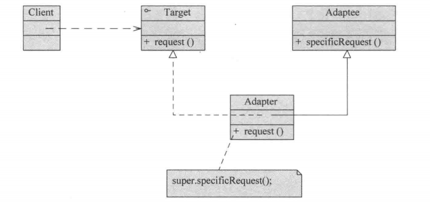
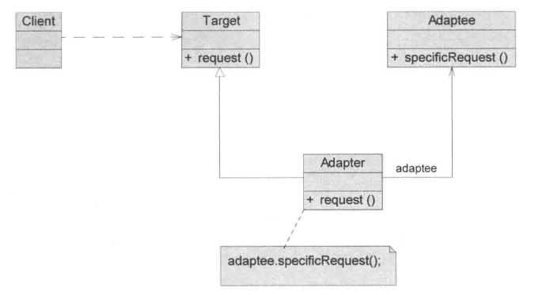
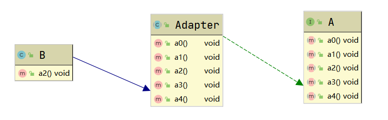

# 适配器模式
## 1. 现实生活中的适配器
两孔的插头，可以通过多功能转换插头（适配器）去适应三孔的插板。

## 2. 基本介绍
1. 适配器模式将某个类的接口转换为客户端期望的另一个接口表示，主要目的是兼容性，让原本因接口不匹配不能一起工作的两个类可以协调工作。其别名为包装器。
2. 适配器模式属于结构型模式，分为三类：类适配器模式、对象适配器模式、接口适配器模式。

## 3. 工作原理
1. 适配器模式：将一个类的接口转换为另一种接口，让原本接口不兼容的类可以兼容。
2. 从用户的角度看不到适配者，是解耦的。
3. 用户调用适配器转换出来的目标接口方法，适配器再调用被适配者的相关接口方法。
4. 用户收到反馈结果，感觉只是和目标接口交互。

## 4. 类适配器模式
### 4.1 应用实例
以生活中充电器的例子来讲解适配器，充电器本身相当于Adapter类（目标抽象类），220V交流电相当于Adaptee类（被适配类），5V直流电为Target类（目标抽象类），手机相当于Client（客户端）。

### 4.2 思路分析


### 4.3 代码实现
```java
/**
 * @ProjectName: 设计模式
 * @ClassName: Adaptee  200V为被适配类
 * @Auther: wczy
 * @Date: 2020-12-02 22:19
 * @Version 1.0
 **/
public class Adaptee {
    public int  output220V(){
        int src = 220;
        System.out.println("电压："+src);
        return src;
    }
}
```
```java
/**
 * @ProjectName: 设计模式
 * @ClassName: Target  目标为5V
 * @Auther: wczy
 * @Date: 2020-12-02 22:13
 * @Version 1.0
 **/
public interface Target {
    public int output5V();
}
```
```java
/**
 * @ProjectName: 设计模式
 * @ClassName: Adapter  适配器类
 * @Auther: wczy
 * @Date: 2020-12-02 22:21
 * @Version 1.0
 **/
public class Adapter extends Adaptee implements Target {
    @Override
    public int output5V() {
        int src = output220V();
        int dst = src/44;
        return dst;
    }
}
```
```java
/**
 * @ProjectName: 设计模式
 * @ClassName: Client  手机为客户端
 * @Auther: wczy
 * @Date: 2020-12-02 22:22
 * @Version 1.0
 **/
public class Client {
    Target target = new Adapter();
    public void charge(){
        int src = target.output5V();
        if (src==5) System.out.println("充电中");
    }
}
```

### 4.4 类适配器模式注意事项和细节
1. 总所周知，Java是单继承机制，同时Adapter类需要继承Target类，所以Target必须是接口，有一点局限性。
2. Adaptee类的方法在Adapter类中都会暴露出来，增加了使用的成本。
3. Adapter类实现了Target接口，Adapter类可以根据需求重写Target接口的方法，增强了灵活性。

## 5. 对象适配器
### 5.1 基本介绍
1. 基本思路和类适配器模式相同，只是将Adapter类作修改，不是继承Adaptee类，而是持有src类的实例，以解决兼容性的问题。
2. 根据“合成复用原则”，在系统中尽量使用关联关系（聚合）来替代继承关系。
3. 对象适配器模式是适配器模式常用的一种。

### 5.2 思路分析


### 5.3 代码实现上述应用实例
只需要改变Adapter类
```java
/**
 * @ProjectName: 设计模式
 * @ClassName: Adapter  适配器类
 * @Auther: wczy
 * @Date: 2020-12-02 22:48
 * @Version 1.0
 **/
public class Adapter implements Target {
    Adaptee adaptee = new Adaptee();
    @Override
    public int output5V() {
        int src = adaptee.output220V();
        int dst = src/44;
        return dst;
    }
}
```

### 5.4 对象适配器模式注意事项和细节
1. 对象适配器模式和类适配器模式是同一种思想，只是实现方式不同。根据合成复用原则，使用组合替代继承，解决了Adapter类必须继承Adaptee类的局限性问题，也不再要求Target类必须是接口。
2. 使用成本更低，更灵活。

## 6. 接口适配器模式
### 6.1 基本介绍
1. 核心思路：当不需要全部实现接口提供的方法时，可先设计一个抽象类实现接口，并为该接口中每个方法提供一个默认实现（空方法），那么由该抽象类的子类可以由选择地覆盖父类的某些方法来实现需求。
2. 适用于不需要使用一个接口的所有方法的情况。

### 6.2 思路分析


### 6.3 应用实例
```java
public interface A {
    void a0();
    void a1();
    void a2();
    void a3();
    void a4();
}

/**
 * 接口适配器
 */
public abstract class Adapter implements A {

    public void a0() {

    }

    public void a1() {

    }

    public void a2() {

    }

    public void a3() {

    }

    public void a4() {

    }
}
public class B extends Adapter{

    public void a2() {
        super.a2();
    }
}
```