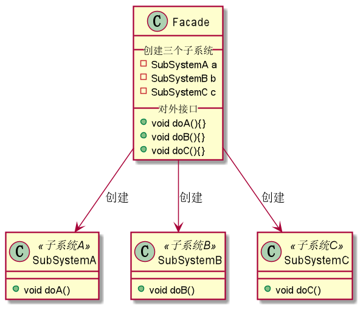
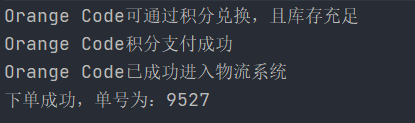
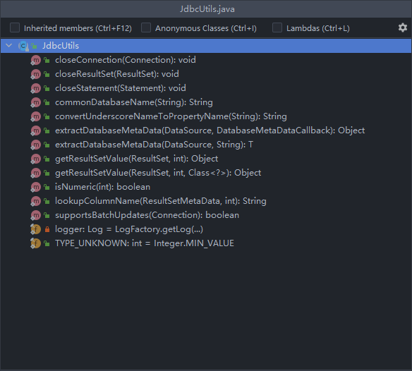

# 门面模式
## 1. 门面模式概述
### 1.1 概述
门面模式又叫作外观模式，提供了一个统一的接口，用来访问子系统中的一群接口。其主要特征是定义了一个高层接口，让子系统更容易使用，属于结构型设计模式。

其实在日常开发中，我们都有意无意地大量地使用门面模式。但凡只要高层模块需要调度多个子系统（比如2个以上地类对象），我们一般都会地创建一个新类封装这些子系统，提供精简的
接口，让高层模块可以更加容易地简接调用这些子系统的功能。尤其是现在各种第三方SDK，开源类库，很大部分都会使用门面模式。

### 1.2 应用场景
门面模式不仅在日常开发中常见，在日常生活中门面模式也有很多体现。比如一个网站的首页，一般首页作为整个网站的入口，它提供了很多子栏目的超链接，用户可以通过该首页就可以进
入各个子栏目的页面，这个首页就好比一个门面；再比如去医院就诊，大部分的医院都设置了导诊台，这样无论我想去皮肤科、内科、外科又或者是妇科，都不需要到处乱转，整个路线变得
非常清楚，这个导诊台也相当于一个门面。

在日常开发中，门面模式适用于以下场景：
1. 为一个复杂的模块或子系统提供一个简洁的供外界访问的接口；
2. 希望提高子系统的独立性；
3. 当子系统由于不可避免地暂时原因导致可能存在Bug或性能相关问题时，可以通过门面模式提供一个高层接口，隔离客户端与子系统的直接交互，预防代码污染。

## 2. 门面模式实现
### 2.1 UML类图


从上图可以看到，门面模式主要包含2个角色：
1. 外观角色(Facade)：也叫作门面角色，是系统对外统一的接口。
2. 子系统角色(SubSystem)：可以同时有一个或多个SubSystem。每个SubSystem都不是iyge单独的类，而是一个类的集合。SubSystem并不知道Facade的存在。对于SubSystem来说，
Facade只是一个客户端而已，即Facade对SubSystem透明。

### 2.2 通用实现
```java
package 结构型设计模式.门面模式.demo;

/**
 * @ProjectName: 设计模式
 * @ClassName: SubSystemA
 * @Auther: wczy
 * @Date: 2020-12-09 20:21
 * @Version 1.0
 **/
public class SubSystemA {
    public void doA(){
        System.out.println("Orange Code AAA");
    }
}

public class SubSystemB {
    public void doB(){
        System.out.println("Orange Code BBB ");
    }
}

public class SubSystemC {
    public void doC(){
        System.out.println("Orange Code CCC");
    }
}
```
```java
/**
 * @ProjectName: 设计模式
 * @ClassName: Facade
 * @Auther: wczy
 * @Date: 2020-12-09 20:23
 * @Version 1.0
 **/
public class Facade {
    private final SubSystemA a;
    private final SubSystemB b;
    private final SubSystemC c;

    public Facade(){
        a = new SubSystemA();
        b = new SubSystemB();
        c = new SubSystemC();
    }

    //三个外部接口
    public void doA(){
        a.doA();
    }

    public void doB(){
        b.doB();
    }

    public void doC(){
        c.doC();
    }
}
```

## 3. 使用门面模式整合已知API的功能
现在有一个商城系统，这个商城中的大部分功能都不是重新开发的，而是要去对接已有的各个子系统的。
假设产品提了一个积分兑换礼品的需求，之前已经开发了积分系统、支付系统、物流系统的接口。如果所有的接口调用全部由前端发送网络请求去调用现有接口，一是会增加前端开发的难度，
二是会增加一些网络请求，影响页面性能。此时就可以发挥门面模式的优势了。将所有现成的接口全部整合到一个类中，由后端提供统一的接口供前端调用，这样前端开发人员就不需要关心
各接口的业务关系，只需要把精力集中在页面交互上。现在用代码模拟一下这个场景。

### 3.1 创建礼品实体类
```java
/**
 * @ProjectName: 设计模式
 * @ClassName: Gift
 * @Auther: wczy
 * @Date: 2020-12-09 20:50
 * @Version 1.0
 **/
public class Gift {
    private String name;

    public Gift(String name){
        this.name = name;
    }

    public String getName() {
        return name;
    }
}
```
### 3.2 各子系统接口
```java
/**
 * @ProjectName: 设计模式
 * @ClassName: QualifyService  积分系统Service，在此需求前已开发完成
 * @Auther: wczy
 * @Date: 2020-12-09 20:54
 * @Version 1.0
 **/
public class QualifyService {

    public Boolean isAvailable(Gift gift){
        //是否可以通过积分兑换，库存是否充足
        System.out.println(gift.getName()+"可通过积分兑换，且库存充足");
        return true;
    }
}
```
```java
/**
 * @ProjectName: 设计模式
 * @ClassName: PaymentService 支付系统Service，在此需求前已开发完成
 * @Auther: wczy
 * @Date: 2020-12-09 20:57
 * @Version 1.0
 **/
public class PaymentService {

    public boolean pay(Gift gift){
        //是否已支付积分
        System.out.println(gift.getName()+"积分支付成功");
        return true;
    }
}
```
```java
/**
 * @ProjectName: 设计模式
 * @ClassName: ShippingService  物流系统，在此需求前已开发完成
 * @Auther: wczy
 * @Date: 2020-12-09 21:00
 * @Version 1.0
 **/
public class ShippingService {

    public String delivery(Gift gift){
        //礼品是否已进入物流系统
        System.out.println(gift.getName()+"已成功进入物流系统");
        //返回单号
        return "9527";
    }
}
```

### 3.3 创建外观角色，对外只开放一个exchange()方法
```java
/**
 * @ProjectName: 设计模式
 * @ClassName: GiftFacadeService  兑换礼物系统，为了完成需求，直接对接之前已开发的子系统
 * @Auther: wczy
 * @Date: 2020-12-09 21:03
 * @Version 1.0
 **/
public class GiftFacadeService {

    private QualifyService qualifyService = new QualifyService();
    private PaymentService paymentService = new PaymentService();
    private ShippingService shippingService = new ShippingService();

    //对外开放兑换礼物的exchange()方法
    public void exchange(Gift gift){
        //校验礼品兑换资格
        if (qualifyService.isAvailable(gift)){
            //校验是否支付积分
            if (paymentService.pay(gift)){
                String orderId = shippingService.delivery(gift);
                System.out.println("下单成功，单号为："+orderId);
            }
        }
    }
}
```

### 3.4 Controller调用兑换礼物系统
```java
/**
 * @ProjectName: 设计模式
 * @ClassName: MainController
 * @Auther: wczy
 * @Date: 2020-12-09 21:09
 * @Version 1.0
 **/
public class MainController {
    private GiftFacadeService giftFacadeService = new GiftFacadeService();

    //对外开放礼品兑换接口
    public void getGift(Gift gift){
        giftFacadeService.exchange(gift);
    }
}
```

### 3.5 客户端调用
```java
/**
 * @ProjectName: 设计模式
 * @ClassName: Client
 * @Auther: wczy
 * @Date: 2020-12-09 21:12
 * @Version 1.0
 **/
public class Client {
    public static void main(String[] args) {
        Gift gift = new Gift("Orange Code");
        MainController controller = new MainController();
        controller.getGift(gift);
    }
}
```

### 3.6 调用结果


## 4.抽象外观类的引入
外观模式最大的缺点在于违背了“开闭原则”，当增加新的子系统或者移除子系统时需要修改外观类，可以通过引入抽象外观类在一定程度上解决该问题，客户端针对抽象外观类进行编程。
对于新的业务需求，不修改原有修改外观类，而对应的增加一个新的具体外观类，由新的具体外观类来关联新的子系统对象，同时通过修改配置文件来达到不修改源代码并更换外观类的
目的

## 5. 门面模式在Spring源码中的应用
Spring JDBC模块下的JdbcUtils类，它封装了与JDBC相关的所有操作。
```java
public abstract class JdbcUtils {

    public static final int TYPE_UNKNOWN = Integer.MIN_VALUE;
    
    private static final Log logger = LogFactory.getLog(JdbcUtils.class);

    public static void closeConnection(@Nullable Connection con) {
		if (con != null) {
			try {
				con.close();
			}
			catch (SQLException ex) {
				logger.debug("Could not close JDBC Connection", ex);
			}
			catch (Throwable ex) {
				// We don't trust the JDBC driver: It might throw RuntimeException or Error.
				logger.debug("Unexpected exception on closing JDBC Connection", ex);
			}
		}
	}

	public static void closeStatement(@Nullable Statement stmt) {
		if (stmt != null) {
			try {
				stmt.close();
			}
			catch (SQLException ex) {
				logger.trace("Could not close JDBC Statement", ex);
			}
			catch (Throwable ex) {
				// We don't trust the JDBC driver: It might throw RuntimeException or Error.
				logger.trace("Unexpected exception on closing JDBC Statement", ex);
			}
		}
	}

	public static void closeResultSet(@Nullable ResultSet rs) {
		if (rs != null) {
			try {
				rs.close();
			}
			catch (SQLException ex) {
				logger.trace("Could not close JDBC ResultSet", ex);
			}
			catch (Throwable ex) {
				// We don't trust the JDBC driver: It might throw RuntimeException or Error.
				logger.trace("Unexpected exception on closing JDBC ResultSet", ex);
			}
		}
	}
    ....
}
```
在来看看它的内部结构



可以很清楚地看到，整合了很多JDBC的相关API，比如Connection的close()方法，Statement的close()方法等等。


