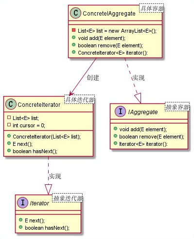

# 迭代器模式
## 1. 迭代器模式概述
### 1.1 定义
迭代器模式又叫作游标模式，它提供一种按顺序访问集合/容器对象元素的方法，而又无须暴露集合内部表示。迭代器模式可以为不同的容器提供一致的遍历行为，而不用关心容器内元素的组成结构，属于行为型设计模式。

**迭代器模式的本质是把集合对象的迭代行为抽离到迭代器中，提供一致的访问接口。**

### 1.2 应用场景
迭代器模式在生活中应用得比较广泛，比如如果将电视机看成一个频道得集合，那么迭代器对应于电视机遥控器，可以使用遥控器对电视频道进行操作，使用遥控器可以方便人们对电视频道进行操作，而且不需要关心这些
频道如何存储在电视机中。在这里，电视机对应于集合对象，而遥控器对应于迭代器。
我们把对个对象聚在一起形成的总体称为集合，集合对象是能够包容一组对象的容器对象。不同的集合其内部元素的结构可能不同，而迭代器模式屏蔽了内部元素的获取细节，为外部提供一致的元素访问行为，解耦了元素
迭代于集合对象之间的耦合，并且通过提供不同的迭代器，可以为同一个集合对象提供不同顺序的元素访问行为，扩展了集合对象元素迭代功能，符合开闭原则。迭代器模式适用于以下应用场景：
1. 访问一个集合对象的内容而无须暴露它的内部表示。
2. 为遍历不同的集合结构提供一个统一的访问接口。

## 2. 迭代器模式实现
### 2.1 UML类图


由上图可以看到，迭代器主要包含四个角色：
1. 抽象迭代器（Iterator）：抽象迭代器负责定义访问和遍历元素的接口。
2. 具体迭代器（ConcreteIterator）：提供具体的元素遍历行为。
3. 抽象容器（IAggregate）：负责定义提供具体迭代器的接口。
4. 具体容器（ConcreteIAggregate）：创建具体迭代器。

### 2.2 通用实现
```java
/**
 * @ProjectName: 设计模式
 * @ClassName: Iterator  抽象迭代器
 * @Auther: wczy
 * @Date: 2020-12-14 19:44
 * @Version 1.0
 **/
public interface Iterator<E> {
    E next();
    boolean hasNext();
}

/**
 * @ProjectName: 设计模式
 * @ClassName: ConcreteIterator  具体迭代器
 * @Auther: wczy
 * @Date: 2020-12-14 19:46
 * @Version 1.0
 **/
public class ConcreteIterator<E> implements Iterator<E>{
    private List<E> list;
    //记录当前游标所除位置
    private int cursor = 0;

    public ConcreteIterator(List<E> list){
        this.list = list;
    }
    @Override
    public E next() {
        return list.get(cursor++);
    }

    @Override
    public boolean hasNext() {
        return cursor<list.size();
    }
}
```
```java
/**
 * @ProjectName: 设计模式
 * @ClassName: IAggregate  抽象容器
 * @Auther: wczy
 * @Date: 2020-12-14 19:45
 * @Version 1.0
 **/
public interface IAggregate<E> {
    boolean add(E element);
    boolean remove(E element);
    Iterator<E> iterator();
}

/**
 * @ProjectName: 设计模式
 * @ClassName: ConcreteIAggregate  具体容器
 * @Auther: wczy
 * @Date: 2020-12-14 19:58
 * @Version 1.0
 **/
public class ConcreteIAggregate<E> implements IAggregate<E> {
    private List<E> list = new ArrayList<>();

    @Override
    public boolean add(E element) {
        return list.add(element);
    }

    @Override
    public boolean remove(E element) {
        return list.add(element);
    }

    @Override
    public Iterator<E> iterator() {
        return new ConcreteIterator<E>(list);
    }
}
```

## 3. 迭代器模式在JDK源码中的应用
JDK中的Iterator应该斗非常熟悉：
```java
package java.util;

import java.util.function.Consumer;
public interface Iterator<E> {

    boolean hasNext();

    E next();

    default void remove() {
        throw new UnsupportedOperationException("remove");
    }

    default void forEachRemaining(Consumer<? super E> action) {
        Objects.requireNonNull(action);
        while (hasNext())
            action.accept(next());
    }
}
```
从上面代码中，我们看到定义了两个主要方法hasNext()和next()方法，和之前写的完全一致。