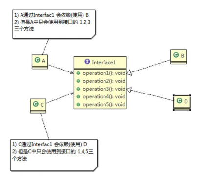
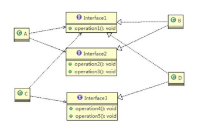
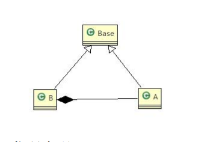
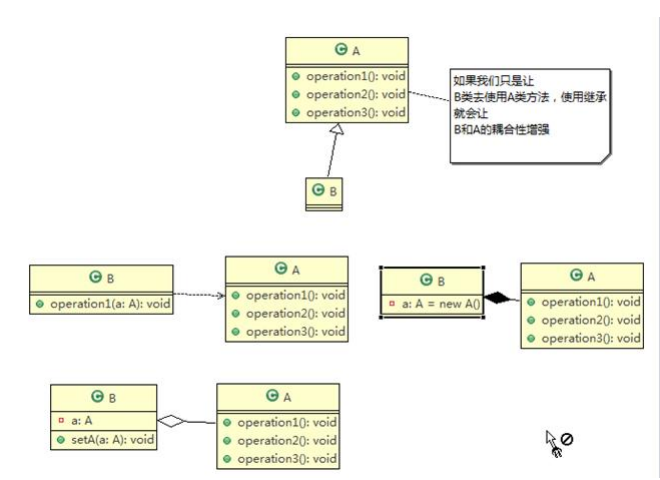

# 设计模式七大原则
## 1. 设计模式的目的
编写软件过程中，程序员面临着来自耦合性，内聚性以及可维护性，可扩展性，重用性，灵活性等多方面的挑战，设计模式就是为了让程序具有更好的：

    1、代码重用性；
    2、可读性；
    3、可扩展性；
    4、可靠性；
    5、使程序呈现高内聚，低耦合的特性。
## 2. 设计模式的七大原则
### 2.1 单一职责原则
对类来说，**即一个类只负责一项职责**。如A类负责两个职责：职责1，职责2。当职责1需求变更二改变A类时，可能造成职责2执行错误，所以需要将类A的粒度分解为A1，
A2。
#### 2.1.1 单一职责原则注意事项和细节
1、降低类的复杂度，一个类只负责一项职责；

2、提高类的可读性，可维护性；

3、降低变更引起的风险；

4、通常情况下，我们应该遵守单一职责原则，只有逻辑足够简单，才可以在代码级违反单一职责原则；只有类中的方法足够少，可以在方法级别保持单一职责原则。
### 2.2 接口隔离原则
#### 2.2.1 基本介绍
客户端不应该依赖它不需要的接口，即**一个类对另一个类的依赖应该建立在最小的接口上**。

####2.2.2 应用实例
如图所示：


类A通过接口Interface1依赖类B，类C过接口Interface1依赖类D，如果Interface1对于类A和类C来说不是最小接口，那么类B和类D必须去实现它们的方法。
    
按照接口隔离原则应该这样处理：将接口Interface1拆分为独立的几个接口（这里拆分为3个），类A和类C分别与它们需要的接口建立依赖关系。也就接口隔离原则。


类B实现Interface1、Interface2，类D实现Interface1、Interface3，类A通过接口去依赖去类B，类C通过接口去依赖类C。
### 2.3 依赖倒转原则
#### 2.3.1 基本介绍
    
    1、高层模块不应该依赖底层模块，二者都是依赖其抽象；
    2、抽象不应该依赖细节，细节应该依赖抽象；
    3、依赖倒转的中心思想是面向接口编程；
#### 2.3.2 依赖倒转的设计理念
相对于细节的多边形，抽象的东西药稳定很多。以抽象为基础搭建的架构比以细节为基础搭建的架构要稳定很多。在Java中，抽象指的是接口或抽象类，细节就是具体的实现类。
使用接口或抽象类的目的是制定要规范，而不涉及任何具体的操作，把展现细节的任务交给它们的实现类去完成。
#### 2.3.3 依赖关系传递的三种方式

    1、接口传递；
    2、构造方法传递；
    3、setter方式传递。
#### 2.3.4 应用案列
```java
public class DependencyPass{
    public static void main(String[] args){
        ChangHong changHong = new ChangHong();
        //通过接口进行依赖传递
        OpenAndClose openAndClose = new OpenAndClose();
        openAndClose.open(changHong);
        //通过构造器进行依赖传递
        OpenAndClose openAndClose = new OpenAndClose(changHong);
        openAndClose.open();
        //通过setter方法进行依赖传递
        OpenAndClose openAndClose = new OpenAndClose();
        openAndClose.setTv(changHong);
        openAndClose.open();
    }
}

//方式1：通过接口传递实现依赖
interface IOpenAndClose{
    public void open(ITV tv);
}
class OpenAndClose implements IOpenAndClose{
    @Override
    public void open(ITV tv){
        tv.play();
    }
}
interface ITV{
    public void play();
}
class ChangHong implements ITV{
    @Override
    public void play(){
        System.out.println("长虹电视机，打开");
    }
}

//方式2：通过构造方法依赖传递
interface IOpenAndClose{
    public void open();
}
class OpenAndClose implements IOpenAndClose{
    public ITV tv;
    public OpenAndClose(ITV tv){this.tv = tv;}
    @Override
    public void open(){
        this.tv.play();
    }
}
interface ITV{
    public void play();
}
class ChangHong implements ITV{
    @Override
    public void play(){
        System.out.println("长虹电视机，打开");
    }
}

//方式3：通过setter方法依赖传递
interface IOpenAndClose{
    public void open();
    public void setTv(ITV tv);
}
class OpenAndClose implements IOpenAndClose{
    public ITV tv;
    @Override
    public setTv(ITV tv){this.tv = tv;}
    @Override
    public void open(){
        this.tv.play();
    }
}
interface ITV{
    public void play();
}
class ChangHong implements ITV{
    @Override
    public void play(){
        System.out.println("长虹电视机，打开");
    }
}
```
#### 2.3.5 依赖倒转原则的注意事项和细节
1、地层模块尽量都要有抽象类或接口，或者两者都有，程序稳定性更好。

2、变量的声明类型尽量是抽象类或接口，这样我们的变量引用和实际对象间，就存在一个缓冲层，利于程序扩展和优化。

3、继承时遵循里氏替换原则
### 2.4 里氏替换原则
#### 2.4.1 OO中的继续性的思考和说明
1、继承包含这样一层含义：父类中凡是已经实现好的方法，实际上是在设定规范和契约，虽然它不强制要求所有的子类必须遵循这些契约，但是如果子类对这些已经实现的
方法任意修改，就会对整个继承体系造成破坏；

2、继承在给程序带来便利的同时，也带来了弊端。比如使用继承会给程序带来侵入性，程序的可移植性降低，增加对象间的耦合性。

3、所以在编程如何正确的使用继承？就是里氏替换原则。
#### 2.4.2 基本介绍

    1、如果对每个类型为T1的对象o1，都有类型为T2的对象o2，使得以T1定义的所有程序P在所有的对象o1都代换成o2时，程序P的行为没用发生变化，那么类型T2就是
    类型T1的子类型，换句话说，所有引用基类的地方必须能透明地使用其子类地对象。
    2、在使用继承时，遵循里氏替换原则，在子类中尽量不要重写父类地方法。
    3、里氏替换告诉我们，继承实际上让两个类耦合性增强了，在适当地情况下，可以通过聚合，组合，依赖来解决问题。

#### 2.4.3应用案列
```java
class A{
    //返回两个数的差
    public int func1(int num1,int num2){
        return num1-num2;
    }
}
//B类增加一个新功能：完成两个数相加，然后与9求和
class B extends A{
    //重写A类的方法，可能是无意识的
    @Override
    public int func1(int num1,int num2){
        return num1+num2;
    }
    
    public int func2(int num1,int num2){
        return func1(num1,num2)+9;
    }
}
public class Test{
    public static void main(String[] args){
        B b = new B();
        //这里本意是求11-3
        System.out.println(b.func1(1,8));
        System.out.println(b.func1(11,3));
        System.out.println(b.func2(11,3));
    }
}
```
1、这个样子原本运行正常的相减功能发生了错误。原因就是B类中无意重写了父类的方法，造成原有功能出现错误。在实际编程中，常常会通过重写父类的方法完成新的功能，
这样写起来虽然简单，但是整个继承体系的复用性会比较差。特别是运行多态比较频繁的时候。

2、解决的通用方法：原来的父类和子类都继承一个更通俗的基类，原有的继承关系去掉，采用依赖，聚合，组合的等关系替代。

3、改进方案：A类和B类继承同一个基类，A和B之间的采用组合的关系，因为B类不再继承A类，因此调用完成的功能会狠明确。


### 2.5 开闭原则
#### 2.5.1 基本介绍
    
    1、开闭原则是编程中最基础的、最重要的设计原则；
    2、一个软件体如类，模块和函数应该对扩展开放（对提供方），对修改关闭（对使用方）。用抽象构建框架，用实现扩展细节；
    3、当软件需要变化时，尽量通过扩展软件实体的行为来实现变化，而不是通过修改已有的代码来实现变化；
    4、编程中遵循其他原则，以及设计模式的目的就是遵循开闭原则。
    
### 2.6 迪米特原则
#### 2.6.1 基本介绍

    1、一个对象应该对其他对象保持最少的了解；
    2、类与类的关系越密切，耦合性越大；
    3、迪米特原则又叫最少知道原则，即一个类对自己依赖的类知道得越少越好。也就是说，对于被依赖的类不管多么复杂，都尽量将逻辑封装在类的内部。对外出了提供的
    public方法，不对外泄露任何信息；
    4、迪米特法则还有个简单的定义：只与直接的朋友通信；
    5、直接的朋友：每个对象都会与其他对象已有耦合关系，只要两个对象之间有耦合关系，我们就说这两个对象之前是朋友关系。耦合的方式很多，依赖，关联，组合，聚合
    等。其中，我们称出现成员变量，方法参数，方法返回值中的类为直接的朋友，而出现在局部变量中的类不是直接的朋友。也就是说，陌生的类最
    号不要以局部变量的形式出现在类的内部。
   
#### 2.6.2 迪米特法则注意事项和细节

    1、迪米特法则的核心就是降低类之间的耦合；
    2、由于每个类都减少了不必要的依赖，因此迪米特法则只是要求降低类间（对象间）的耦合关系，并不是要求完全没用依赖关系。
    
### 2.7 合成复用原则
#### 2.7.1 基本介绍
尽量使用合成/聚合的关系，而不是使用继承。
